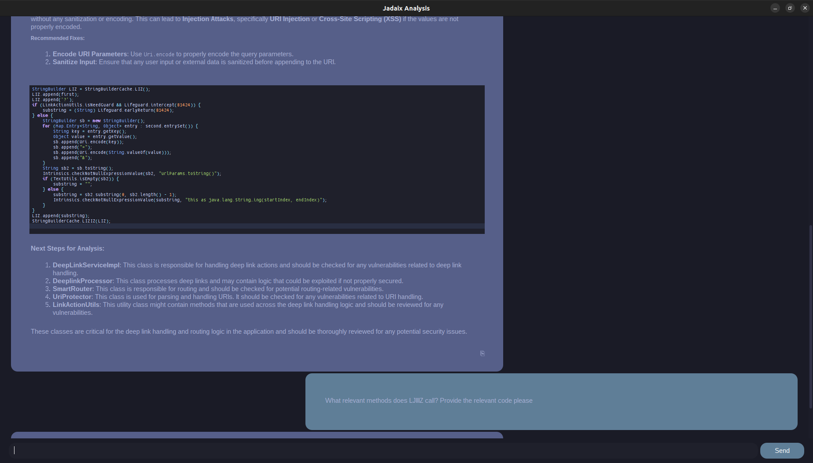
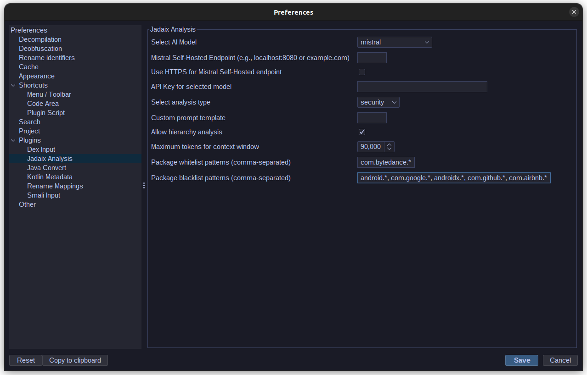
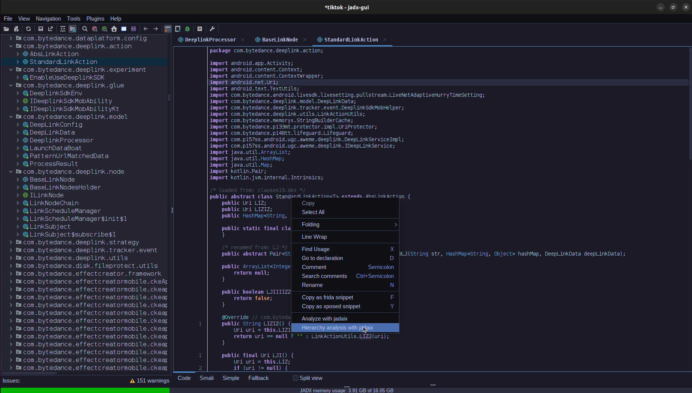

# Jadaix Plugin for JADX

A JADX plugin for interactive code analysis using Large Language Models (LLMs). Provides dynamic code analysis, security assessment, malware analysis, and contextual understanding of decompiled Android applications.


## Features

### Analysis Types
- **Single Class Analysis**: Analyze individual classes
- **Method Analysis**: Detailed analysis of specific methods with context
#### Hierarchy Analysis
Performs deep analysis of class relationships by:

1. **Direct Relationships**
   - Analyzes superclass inheritance chain
   - Identifies implemented interfaces
   - Maps inner classes and their relationships

2. **Usage Analysis**
   - Scans for direct references in code
   - Identifies classes that use the target class
   - Traces method invocations and field usage
   - Maps package-level relationships

3. **Package Scanning**
   - Uses package prefix matching for efficient scanning
   - Optimizes relationship finding for large codebases
   - Applies whitelist/blacklist patterns for focused analysis

4. **Memory Efficient Processing**
   - Analyzes classes on-demand without storing relationship maps
   - Uses pattern caching to optimize repeated checks
   - Maintains minimal memory footprint for large apps (400,000+ classes)
   - Limits analysis depth to 2 levels to prevent recursion issues

5. **Example Hierarchy Flow**:
```
TargetClass
│
├── SuperClasses
│   ├── DirectSuperClass
│   └── IndirectSuperClass
│
├── Interfaces
│   ├── DirectInterfaces
│   └── IndirectInterfaces
│
├── Usage
│   ├── ClassesUsingTarget
│   └── ReferencingClasses
│
└── Related
    ├── SamePackageClasses
    └── DirectlyReferencedClasses
```
6. **Performance Tips**
   - Use specific package patterns in whitelist
   - Blacklist common framework packages
   - Start with key classes in the application

### Analysis Modes
- **Security Analysis**: Identifies potential security vulnerabilities, focusing on concrete findings in the code
- **Malware Analysis**: Analyzes code for potential malicious behaviors and patterns
- **Custom Analysis**: User-defined analysis with custom prompts



### LLM Support
- OpenAI (GPT-4)
- Claude (Anthropic)
- Mistral
- Self-hosted Mistral

## Installation

1. Build the plugin:
```bash
./gradlew clean build
```

2. Install the plugin in JADX:
- GUI: Preferences → Plugins → Install plugin → Select built jar
- CLI: `jadx plugins --install-jar jadaix-plugin.jar`

## Configuration

### LLM Settings
- Model Selection (GPT-4, Claude, Mistral)
- API Keys
- Mistral Self-hosted Endpoint
- Analysis Type Selection (Security/Malware/Custom)
- Custom Prompt Configuration

### Analysis Filters
Default blacklist patterns (can be customized):
```
android.*, androidx.*, com.google.*, java.*, javax.*, 
kotlin.*, dalvik.*, org.json.*, org.xml.*, 
org.w3c.*, org.apache.*, sun.*
```

## Chat Interface Features
- Syntax highlighting for code blocks
- Markdown rendering for explanations
- Copy button for responses
- Persistent chat history
- Tokyo Night theme (yes its riced)

## Performance Notes
- Hierarchy analysis performance depends on codebase size
- Use blacklist patterns to exclude irrelevant packages
- Memory efficient, suitable for large applications
- Manages token limits automatically
- Be careful with token usage, Hierarchy analysis will burn through them quickly set context limits!
- Chat context is maintained like a standard chatbot (each message will include the full chat context plus the new message, so account for this with token usage)